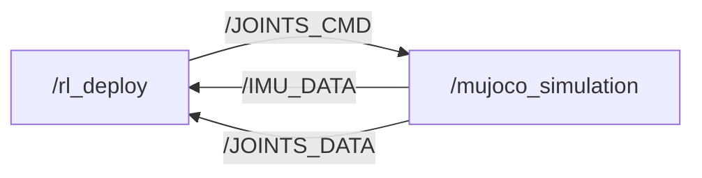

# S10 SDK Deploy

[](https://discord.gg/gdM9mQutC8)
## Overview
This repository uses ROS2 to implement the entire Sim-to-sim and Sim-to-real workflow. Therefore, ROS2 must first be installed on your computer, such as installing [ROS2 Jazzy](https://docs.ros.org/en/jazzy/index.html) on Ubuntu 24.04. Since our S10 robot has a Ubuntu 24.04 system, you should also install Ubuntu 24.04 and ROS2 Jazzy on your development environment.Please go through the whole process on a Ubuntu system.


## Sim-to-sim

```bash
pip install "numpy < 2.0" mujoco
git clone https://github.com/DeepRoboticsLab/goai_embodied_future_material.git

# Compile
cd goai_embodied_future_material
source /opt/ros/jazzy/setup.bash
colcon build --packages-up-to s10_sdk_deploy --cmake-args -DBUILD_PLATFORM=x86
```

```bash
# Run (Open 2 terminals)
# Terminal 1
export ROS_DOMAIN_ID=1
source install/setup.bash
ros2 run s10_sdk_deploy rl_deploy

# Terminal 2 
export ROS_DOMAIN_ID=1
source install/setup.bash
python3 src/S10_sdk_deploy/interface/robot/simulation/mujoco_simulation_ros2.py
```

### Control (Terminal 2)

<span style="color: red;">**Note:**</span>
> - Right click simulator window and select "always on top"
> - When the robot dog stands up, it may become stuck due to self-collision in the simulation. This is not a bug; please try again.
> - z： default position
> - c： rl control default position
> - wasd：forward/leftward/backward/rightward
> - qe：clockwise/counter clockwise
